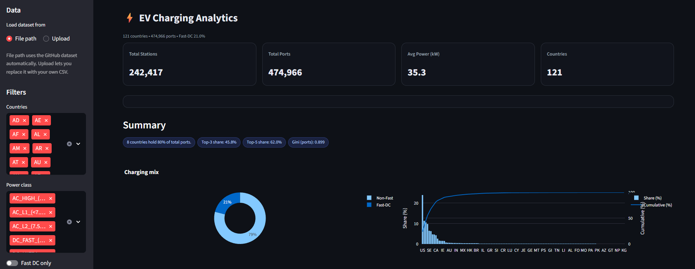
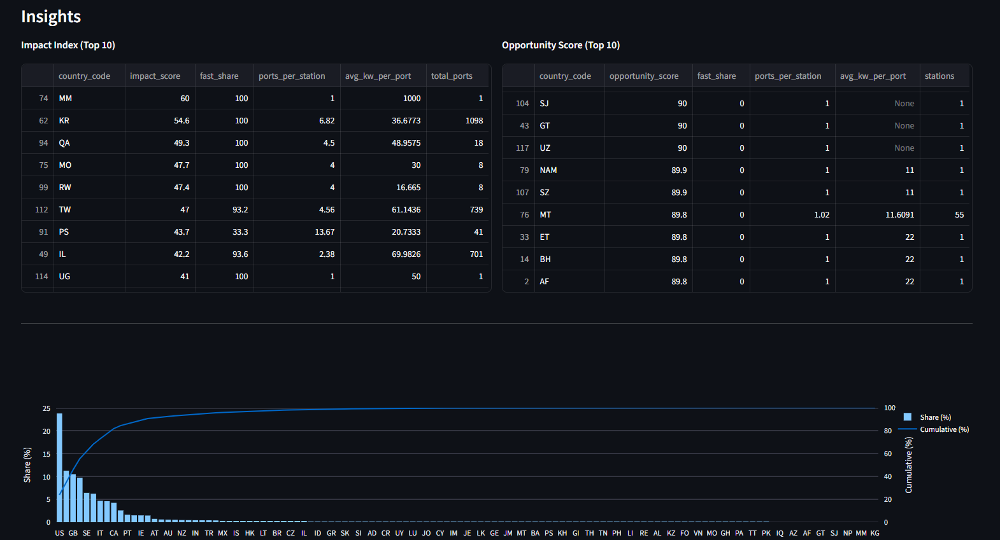
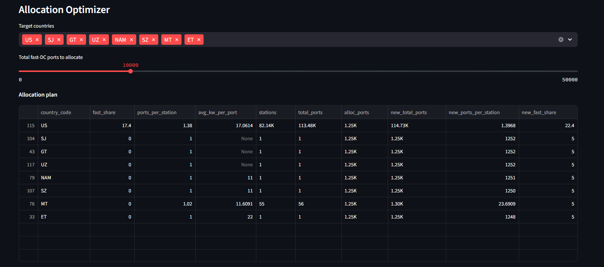

# ⚡ EV Charging Analytics Dashboard


[](https://streamlit.io/)  
[](LICENSE)  
[](DATA_LICENSE)  
[](https://github.com/tarekmasryo)

---

## 🎥 Live Preview


---

## 📌 Overview

Interactive dashboard built with **Streamlit, Plotly, and PyDeck** to explore the  
[Global EV Charging Stations & Models Dataset (2025)](https://github.com/tarekmasryo/Global-EV-Charging-Stations).

- 🌍 242k+ charging stations across 121 countries  
- ⚡ Filters for countries, power classes, and fast-DC  
- 📊 Insights, KPIs, and allocation optimizer  
- 🗺️ Interactive world map with clustering  

---

## 📊 Dashboard Preview

### Overview KPIs


### Advanced Map


### Insights (Impact vs Opportunity)


### Allocation Optimizer


---

## 🔑 Features

- **Filters** by country, power class, ports, and city  
- **KPIs**: total stations, ports, avg kW, fast-DC share  
- **Visuals**: donut charts, bar charts, Lorenz curve  
- **Optimizer**: simulate allocation of new fast-DC ports  
- **Compare mode**: selected vs global/regions  

---

## 🚀 Run Locally

Clone the repo and install requirements:

```bash
git clone https://github.com/tarekmasryo/ev-charging-analytics.git
cd ev-charging-analytics
pip install -r requirements.txt
```

Run the app:

```bash
streamlit run EV-Charging-Analytics.py
```

---

## ☁️ Deploy on Streamlit Cloud

You can deploy directly to [Streamlit Cloud](https://streamlit.io/cloud).  
Make sure your **secrets / env** point to the dataset URL:

```toml
# .streamlit/secrets.toml
DATA_URL = "https://raw.githubusercontent.com/tarekmasryo/Global-EV-Charging-Stations/main/data/charging_stations_2025_world.csv"
```

---

## 📄 License

- **Code** → MIT License (see `LICENSE`)  
- **Data** → CC BY 4.0 (see `OCM_CC_BY_4.0.txt`)  

---

## 🙌 Citation

If you use this dashboard or dataset, please credit as:

> Dashboard and dataset sourced from *Global EV Charging Stations & Models (2025)* by Tarek Masryo, licensed under MIT (code) and CC BY 4.0 (data).
