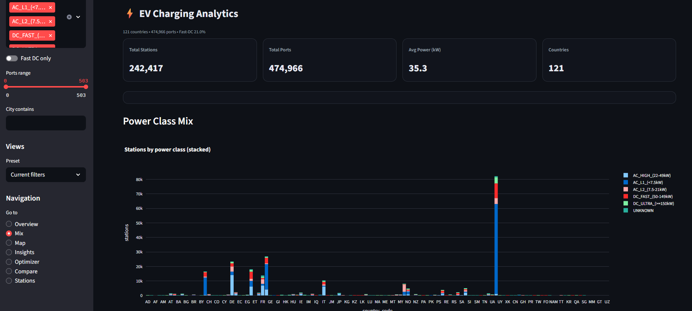

# ⚡ EV Charging Analytics Dashboard

[](https://streamlit.io/)
[](LICENSE)
[](https://docs.astral.sh/ruff/)

Production-style **Streamlit** dashboard for exploring global EV charging infrastructure with **Plotly** and **PyDeck**.

It is designed as a decision-facing analytics tool: infrastructure KPIs, geographic coverage, fast-DC mix, inequality metrics, opportunity scoring, and allocation scenarios.



---

## 📌 Overview

This dashboard explores the **Global EV Charging Stations Dataset**:

- 🌍 Charging stations across multiple countries
- 🎛️ Filters for country, city, power class, fast-DC status, and port range
- 📊 KPIs for stations, ports, average power, and fast-DC share
- 📈 Distribution analytics including Lorenz curve and Gini concentration
- 🗺️ Interactive world map with port-scaled station markers
- 🧮 Allocation optimizer for fast-DC expansion scenarios
- 🧭 Compare mode for selected slices vs global or preset views

Dataset repository:

https://github.com/tarekmasryo/Global-EV-Charging-Stations

---

## 🖼️ Screenshots

**Overview**


**Map**


**Insights**


**Optimizer**


---

## 🔑 Key Features

- Country, city, power-class, fast-DC, and ports filters
- Executive KPIs for charging infrastructure monitoring
- Charging mix analysis by country and power class
- Port concentration analysis with Pareto view, Lorenz curve, and Gini score
- Impact and opportunity scoring for expansion prioritization
- Interactive PyDeck map with station-level markers
- Rule-based optimizer for allocating new fast-DC capacity
- Export-ready tables for country summaries and scenario outputs

---

## 🧱 Project Structure

```text
.
├── EV-Charging-Analytics.py
├── src/ev_charging_dashboard/
│   ├── analytics.py
│   ├── data.py
│   ├── services.py
│   └── __init__.py
├── tests/
├── assets/
├── requirements.txt
├── requirements-dev.txt
├── Makefile
└── pyproject.toml
```

The Streamlit entrypoint is intentionally named:

```text
EV-Charging-Analytics.py
```

Keep this filename when deploying the dashboard.

---

## 🚀 Run Locally

```powershell
python -m venv .venv
.\.venv\Scripts\Activate.ps1
python -m pip install --upgrade pip
python -m pip install -r requirements.txt
python -m streamlit run EV-Charging-Analytics.py
```

If PowerShell blocks activation, run this only for the current shell:

```powershell
Set-ExecutionPolicy -Scope Process -ExecutionPolicy Bypass
```

---

## ⚙️ Data Configuration

The app auto-loads the dataset from the public GitHub raw CSV by default.

You can override the data source in any of the following ways, listed by priority:

1. Query parameter: `?csv=<path_or_url>`
2. Streamlit secrets file: `.streamlit/secrets.toml`

```toml
DATA_URL = "https://raw.githubusercontent.com/tarekmasryo/Global-EV-Charging-Stations/main/data/charging_station.csv"
```

3. Environment variables: `CSV_URL`, `CSV_PATH`, or `DATA_URL`
4. Manual CSV upload from the sidebar

Optional enrichment files:

- `world_population.csv`
- `country_region.csv`

When these files are missing, enrichment metrics are skipped gracefully.

---

## ☁️ Deploy on Streamlit Community Cloud

1. Push this repository to GitHub.
2. Create a new Streamlit Cloud app from the repository.
3. Set the main file path to:

```text
EV-Charging-Analytics.py
```

4. Add `DATA_URL` in Streamlit Secrets when you want to override the default dataset URL.

---

## 🧪 Development

Install development tools:

```bash
python -m pip install -r requirements-dev.txt
pre-commit install
```

Run checks:

```bash
ruff check .
ruff format --check .
pytest -q
```

Or use:

```bash
make lint
make format-check
make test
```

---

## 📜 License & Attribution

- Code: **Apache-2.0**. See `LICENSE`.
- Dataset: hosted in the linked dataset repository.

Attribution:

> Global EV Charging Dashboard and Dataset by **Tarek Masryo**.
