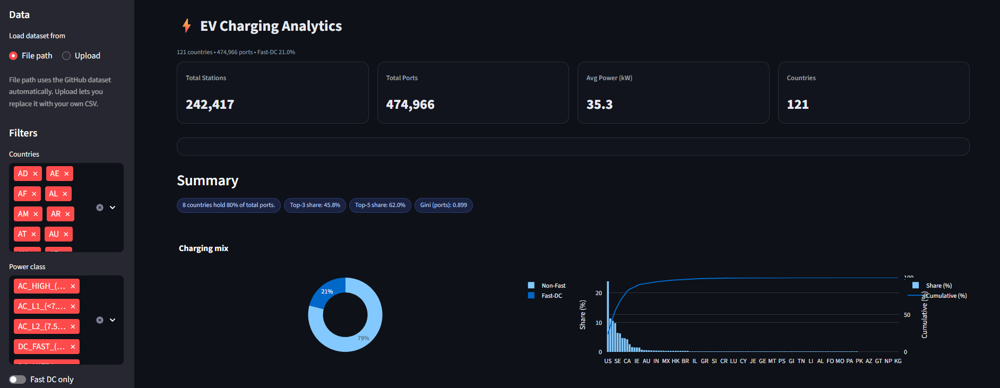
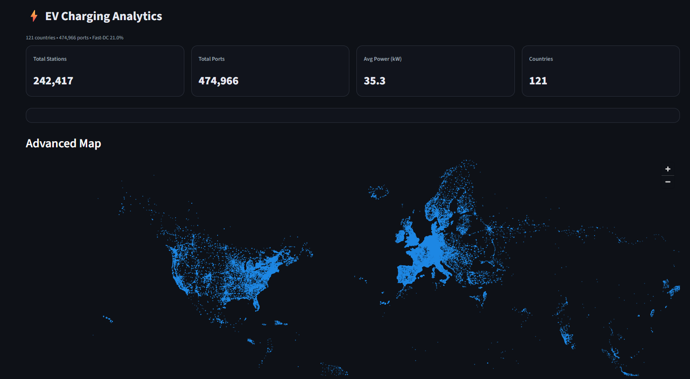
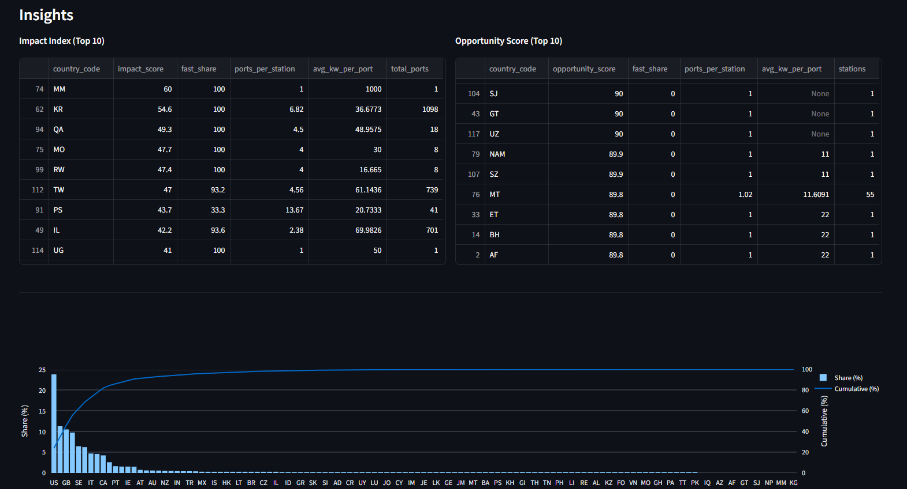
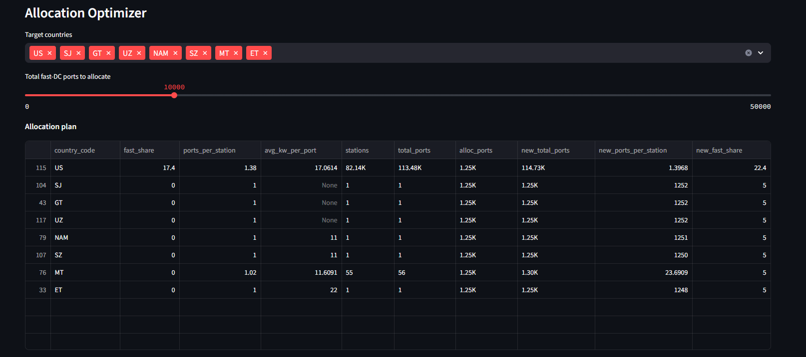

# ⚡ EV Charging Analytics Dashboard

[](https://streamlit.io/)
[](LICENSE)
[](https://docs.astral.sh/ruff/)

Production-style **Streamlit** dashboard for exploring global EV charging infrastructure with **Plotly** and **PyDeck**.  
The repo is structured as a package (`src/`), with automated checks (Ruff) and a test suite (Pytest).

---

## 🎥 Live Preview


---

## 📌 Overview

This dashboard explores the **Global EV Charging Stations & Models Dataset (2025)**:

- 🌍 242k+ charging stations across 121 countries
- 🎛️ Filters: country, power class, fast-DC, ports
- 📊 KPIs and distribution insights (including Lorenz curve + Gini)
- 🗺️ Interactive world map with clustering
- 🧮 Allocation optimizer for fast-DC expansion scenarios

📦 Dataset repository:
- https://github.com/tarekmasryo/Global-EV-Charging-Stations

---

## 🖼️ Screenshots

**Overview**  


**Map**  


**Insights**  


**Optimizer**  


---

## 🔑 Key Features

- 🎛️ Country/city/power-class filters
- 📈 KPIs: total stations, ports, avg kW, fast-DC share
- 📊 Visuals: donut charts, bar charts, Lorenz curve + Gini
- 🧮 Optimizer: simulate allocation of new fast-DC ports
- 🧭 Compare mode: selected slice vs global

---

## 🧱 Project Structure

```text
.
├── app.py
├── src/ev_charging_dashboard/
│   ├── analytics.py
│   ├── data.py
│   ├── services.py
│   └── ...
├── tests/
├── assets/
├── requirements.txt
├── requirements-dev.txt
└── pyproject.toml
```

---

## 🚀 Run Locally

```powershell
python -m venv .venv
.\.venv\Scripts\Activate.ps1
python -m pip install -U pip
python -m pip install -r requirements.txt
streamlit run app.py
```

Notes:
- `requirements.txt` installs the local package in editable mode (`-e .`) so `ev_charging_dashboard` imports work out of the box.
- If PowerShell blocks activation:
  `Set-ExecutionPolicy -Scope Process -ExecutionPolicy Bypass`

---

## ⚙️ Data Configuration

The app auto-loads the dataset from the public GitHub raw CSV by default.  
You can override the data source in any of the following ways (highest priority first):

1) 🔗 **Query param**: `?csv=<path_or_url>`
2) 🔐 **Streamlit secrets** (`.streamlit/secrets.toml`):
```toml
DATA_URL = "https://raw.githubusercontent.com/tarekmasryo/Global-EV-Charging-Stations/main/data/charging_station.csv"
```
3) 🌱 **Environment variables** (first one found is used): `CSV_URL`, `CSV_PATH`, `DATA_URL`

Optional enrichment files:
- 🌐 `world_population.csv`
- 🧭 `country_region.csv`

If these files are not present, related enrichment metrics will be skipped gracefully.

---

## ☁️ Deploy (Streamlit Community Cloud)

1) Push this repository to GitHub.
2) Create a new Streamlit Cloud app from the repo.
3) Set `DATA_URL` in Streamlit **Secrets** (recommended), or rely on the default auto-load URL.

---

## 🧪 Development

Install dev tools:

```bash
pip install -r requirements-dev.txt
pre-commit install
```

Run checks:

```bash
ruff check .
ruff format .
pytest -q
```

---

## 📜 License & Attribution

- ✅ Code: **Apache-2.0** (see `LICENSE`)
- ✅ Dataset: hosted in the dataset repository (see link above)

If you use the dashboard or dataset, please credit:

> Global EV Charging Dashboard and Dataset by **Tarek Masryo**.
